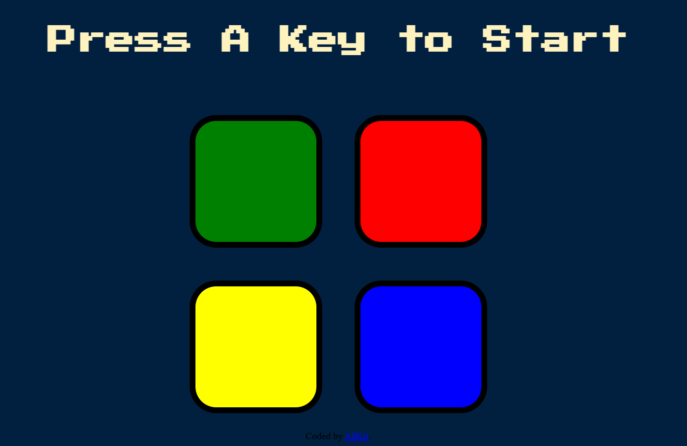

# Simon Game 🎮

A web-based implementation of the classic **Simon Game**, where players must repeat an increasingly complex sequence of colors and sounds.

## 🚀 Project Overview

The Simon Game is a memory-based game that tests how well players can remember patterns.
Each round, the game adds a new color to the sequence, and the player must reproduce the sequence correctly to continue.

If the player makes a mistake, the game ends and can be restarted.

## 🛠️ Technologies Used

* **HTML**
* **CSS**
* **JavaScript**


## 🎯 Features

* Randomly generated color sequence
* Sound effects for each button
* Increasing difficulty as levels progress
* Game over animation and restart functionality
* Interactive UI with button animations

## 🎮 How to Play

1. Press any key to start the game.
2. Watch the color sequence displayed by the game.
3. Repeat the sequence by clicking the colored buttons.
4. Each level adds a new color to the sequence.
5. If you press the wrong button, the game ends.

## 📂 Project Structure

```
SimonGame
│
├── index.html
├── styles.css
├── game.js
└── sounds/
    ├── red.mp3
    ├── blue.mp3
    ├── green.mp3
    ├── yellow.mp3
    └── wrong.mp3
```

## 📸 Preview

## 📸 Screenshot



## 🔗 Live Demo

🎮 Play the game here:  
[Simon Game Live Demo](https://ankit1840.github.io/Simon-game/)


## ▶️ Run the Project

1. Clone the repository

```
git clone https://github.com/yourusername/SimonGame.git
```

2. Open the folder

```
cd SimonGame
```

3. Run `index.html` in your browser.

## 📌 Future Improvements

* Add mobile responsiveness
* Add difficulty levels
* Add score leaderboard
* Convert to React version

## 👨‍💻 Author

KiT
